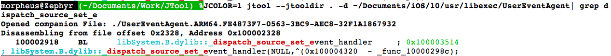

## 堆栈模拟 

函数的堆栈模拟我已经推迟了很长时间，但我觉得现在是时候了。按照STR/STP 我研究了相当长一阶段：jtool现在可以动态检测blocks，让你知道哪个函数包含它。
例如，dispatch_[a]sync or xpc_connection_set_event_handler:




更妙的是，它可以动态跟踪mach_msg构造。这真的非常有用，我的“MOXiI Vol.1”的@TODO之一是记录所有的SpringBoard，Backboard和其他进程的MIG。你可以看到这个节省了多少时间呢？

```
# Note that:
# A) you need to disable color for the regexp to work (because of curses sequences)
# B) the regexp is then "mach_msg(" (decompiled function) or "begins with _" (function label)
# C) jtool does everything in the cache, no need to extract!
#
morpheus@Zephyr (~/Documents/Work/JTool) % JCOLOR=0 jtool -d dyld_shared_cache_arm64:BackBoardServices |
|                                           egrep "(_mach_msg\(|^_)" | less
_BKSRestartActionOptionsDescription: # No mach_msg here 
_BKSTouchDeliveryPolicyServerGetProxyWithErrorHandler: # No mach_msg here either..
__BKSHIDGetBacklightFactor:
; _mach_msg(6000000)
__BKSHIDSetBacklightFactorPending:
; _mach_msg(6000001)
__BKSHIDSetBacklightFactorWithFadeDuration:
; _mach_msg(6000002)
__BKSHIDSetBacklightFactorWithFadeDurationAsync:
; _mach_msg(6000003)
..
morpheus@Zephyr (~/Documents/Work/JTool) % jtool -d dyld_shared_cache_arm64:BackBoardServices |
                                            egrep "(_mach_msg\(|^_)"       
_BKSRestartActionOptionsDescription: 
_BKSTouchDeliveryPolicyServerGetProxyWithErrorHandler: 
__BKSHIDGetBacklightFactor:
; _mach_msg(6000000)
__BKSHIDSetBacklightFactorPending:
; _mach_msg(6000001)
__BKSHIDSetBacklightFactorWithFadeDuration:
; _mach_msg(6000002)
...
__BKSHIDSetHardwareKeyboardLayout:
; _mach_msg(6000056)
__BKSHIDGetHardwareKeyboardLanguage:
; _mach_msg(6000057)
__BKSHIDSetEventRouters:
; _mach_msg(0)  # OK, so it's not perfect -- I don't follow FP operations (yet)!
__BKSHIDSetKeyCommands:
; _mach_msg(6000059)
__BKSHIDSetStackshotCombos:
; _mach_msg(6000059)
__BKSHIDSetTouchHand:
; _mach_msg(6000061)
__BKSDisplayStart:
; _mach_msg(6001000)
__BKSDisplayIsDisabled:
; _mach_msg(6001001)
..
```
